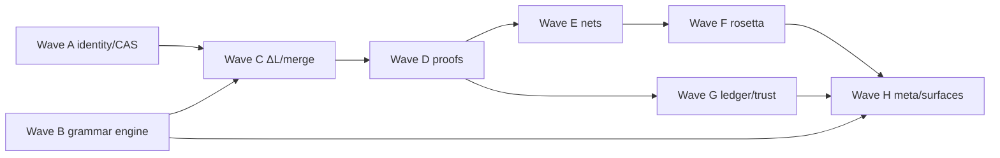

# Cairn — Maximalization Plan (PLAN-2, 50 stories)

[PLAN.md](PLAN.md) (S1–S50) built every feature as the **thinnest honest slice** that
satisfied [CAIRN-PROMPT.md](CAIRN-PROMPT.md). This plan takes each shipped feature to
its **maximal** form. Numbering continues at **M1–M50**. Ground rules stay in force:
layer DAG, everything-is-data, kernel certifies, tests before features, no fake stubs.

Each story lists: current minimal state → maximal target, with acceptance criteria (AC).
Waves are dependency-ordered; stories within a wave are largely parallel.

---

## Wave A — Identity, CAS, storage (M1–M5)

- **M1. Structural type fingerprints.** *Now:* `typeHash` = digest of (kind, body head
  tag). *Max:* full structural fingerprint — recursive shape signature of the canonical
  body (tags, arities, field names), so `TypedKey` distinguishes any two artifact
  schemas; fingerprint algorithm documented in `docs/canonical-bytes.md`.
  AC: distinct schemas ⇒ distinct typeHashes; goldens locked; old keys migrate via M4.
- **M2. Alpha-invariant term identity.** *Now:* digests are name-sensitive; α-equivalent
  terms hash differently. *Max:* canonical binder normalization (locally-nameless
  de Bruijn form) applied before hashing `Term` artifacts, driven by the binder-spec
  table; printed surfaces keep user names (stored as trivia, not identity).
  AC: `λx.x` and `λy.y` share a digest; round-trip law still restores names.
- **M3. CAS maintenance: fsck, GC, stats.** *Now:* write-once objects, no lifecycle.
  *Max:* `cairn fsck` (re-hash every object, report corruption), root-tracked mark/sweep
  GC (branch heads + ledger-published keys are roots), `cairn stats` (dedup ratio,
  object counts by kind). AC: GC never collects a reachable blob (property test);
  corrupted object detected and quarantined.
- **M4. Digest agility + migration morphisms.** *Now:* SHA-256 hard-coded. *Max:*
  self-describing digest prefix (`sha256:`), a second algorithm wired (SHA-512/BLAKE3 via
  provider), and a **migration artifact** kind mapping old→new keys, validated by the
  kernel. AC: store readable across algorithm change; migration is itself a published,
  certified artifact.
- **M5. Large-blob chunking.** *Now:* whole-blob objects. *Max:* content-defined
  chunking for blobs over a threshold, Merkle list nodes, streaming read/write.
  AC: 100 MB fixture stores/loads in bounded memory; chunk-level dedup measured by M3 stats.

## Wave B — Grammar engine to full skill vocabulary (M6–M12)

- **M6. Layout combinators.** *Now:* Elem = tok/cat/opt/star/sepBy1/leaves only; all
  shipped surfaces are token-delimited. *Max:* add `block` (offside rule), `run`/`apply`
  (juxtaposition), `adjacent1` (blank-line-gap repetition), `restOfLine`, `tokField`,
  `anyIdentLeaf`, block strings — the full grammar-as-data vocabulary. AC: an
  indentation-sensitive demo grammar and a juxtaposition-application STLC surface
  (`f x y` instead of `((f x) y)`) both pass the round-trip law.
- **M7. Trivia-preserving concrete syntax.** *Now:* whitespace/comments discarded;
  round-trip is tree-level. *Max:* lexer attaches leading trivia to tokens; Cst carries
  optional trivia; printer replays it. `print(parse(s)) == s` **byte-identical** becomes
  the law for unedited regions. AC: comment-bearing fixtures survive parse→print
  byte-for-byte; edited subtrees re-print with canonical layout.
- **M8. Diagnostics with spans.** *Now:* line:col on the failing token only. *Max:*
  every Cst node carries a source span; parse/compose/check errors render source
  excerpts with carets, expected-set summaries, and furthest-failure tracking.
  AC: golden error-message suite; all structured errors cite spans.
- **M9. Static grammar analysis suite.** *Now:* left-recursion check only. *Max:* add
  greedy-catch-all ambiguity lint (general alternative shadowing a specific one, skill
  checklist #7), unreachable-alternative detection, print-rule/parse-rule arity
  agreement check, and duplicate-field-reference check (#4) — run automatically on
  every composed grammar. AC: each lint has a fixture grammar it catches; all shipped
  grammars pass clean.
- **M10. Packrat + incremental parsing.** *Now:* exponential worst-case backtracking.
  *Max:* memoized (packrat) parse; token-range invalidation for incremental re-parse of
  edited regions (feeds M44 LSP). AC: pathological-backtracking fixture goes from
  exponential to linear; re-parse of a 1-char edit touches O(affected) memo cells.
- **M11. Error recovery.** *Now:* first failure aborts. *Max:* panic-mode recovery at
  category-level sync tokens producing partial Csts with `$error` nodes, so tooling can
  operate on broken files. AC: file with 3 seeded errors yields 3 diagnostics and a
  parseable remainder.
- **M12. Non-text surfaces (§2b).** *Now:* text only. *Max:* JSON and binary-canon
  import/export as first-class encodings of any Cst + a per-language surface registry
  (text/JSON/canon) proving "a foreign format is another surface inside the system".
  AC: STLC term → JSON → term round-trip; surface registry queryable per language.

## Wave C — Composition, ΔL, branches to full semantics (M13–M18)

- **M13. True pushouts with interface morphisms.** *Now:* merge-by-equal-name.
  *Max:* explicit interface objects; imports carry **renaming morphisms** (fragment F
  as G with sort S ↦ T), so two fragments using different names for a shared sort
  amalgamate along a declared span instead of colliding. AC: diamond composition with
  renames yields one pushout object; digest independent of rename spelling.
- **M14. Parameterized fragments (functors).** *Now:* fragments are closed values.
  *Max:* fragments abstracted over interface parameters (e.g. `List(E : Sort)`),
  instantiated at composition time; instantiation is hash-stable. AC: one `List`
  fragment instantiated at `Bool` and at `Type` in the same language.
- **M15. Structural ΔL.** *Now:* ΔL ops are module-level (add/replace/remove/rename).
  *Max:* path-addressed within-term edits (`at <path> replace <term>`, insert, wrap),
  still mechanically derived for any L, still recursively closed (`Δ(ΔL)` includes
  path edits over change terms). AC: edit a lambda body without retyping the
  definition; validation rejects paths that don't exist; Δ² path-edit test.
- **M16. Change algebra: compose, invert, commute.** *Now:* change-sets apply only.
  *Max:* sequential composition and inverses of validated change-sets; **footprint
  commutation** decision (disjoint footprints ⇒ commute), enabling Pijul-like semantic
  reordering. AC: `apply(c2∘c1) == apply(c2)∘apply(c1)`; `apply(c⁻¹∘c) == id`;
  commuting pair applies in either order to same digest.
- **M17. Semantic merge for branches.** *Now:* branches never merge. *Max:*
  three-way merge over change histories using M16 commutation: disjoint-footprint
  changes merge automatically; overlaps surface as structured conflicts (never textual
  diff). AC: two branches editing different definitions merge clean; same-definition
  edits produce a conflict artifact naming both change-sets.
- **M18. Language migrations.** *Now:* language versions are unrelated digests.
  *Max:* **revision morphism** artifacts between language versions (ctor renames,
  arity changes with defaults) that transport modules and change-sets across versions,
  kernel-validated. AC: STLC v1 module migrates to a v2 with a renamed constructor;
  stale ΔL terms transport or fail with cited reasons.

## Wave D — Proof layer to a real logic (M19–M24)

- **M19. Side conditions.** *Now:* pure pattern-instance checking; no freshness or
  disequality. *Max:* a closed side-condition vocabulary as data (`x ≠ y`,
  `x # t` freshness, sort membership), evaluated by the checker; shadowing lookup rule
  (`l-there`) becomes sound. AC: derivation exploiting variable shadowing that
  previously slipped through is now rejected; goldens updated.
- **M20. Hypothetical judgments.** *Now:* contexts are hand-encoded list terms.
  *Max:* generic context discipline in `InferRule` (extend/lookup as rule schema
  primitives), so typing rules stop hand-rolling `ctxCons`. AC: STLC typing rules
  rewritten in the generic discipline; PKI-style registries reuse it.
- **M21. Derivation search (type inference).** *Now:* derivations are hand-built.
  *Max:* bounded proof search over inference systems (syntax-directed mode) producing
  checkable derivations — an untrusted proposer whose output the kernel checker still
  certifies (§4.6). AC: `infer(term)` produces a derivation that `check` accepts for
  every golden STLC term; failure yields the blocked goal.
- **M22. Tactic/goal engine (thin but real).** *Now:* none. *Max:* goal state +
  primitive tactics (intro, apply-rule, assumption) + tactic scripts as artifacts;
  never required for checking. AC: id-typing theorem proved by script; the script
  replays to a proof term that the independent checker validates.
- **M23. Quantified claims with property certificates.** *Now:* test suites are
  finite input/expected pairs. *Max:* ∀-claims over generated term distributions
  (generator spec as data), shrinking on failure; certificate records generator seed +
  count. AC: "eval preserves typing" property claim over generated well-typed terms;
  seeded failure reproduces.
- **M24. Agreement theorems as proofs.** *Now:* agreement is property-tested (S43).
  *Max:* the evaluation trace of the tree engine emitted as a **rewrite derivation**
  checkable against the language's rules — every normalization optionally produces a
  certificate. AC: `normalize` with `certify=true` yields a derivation the checker
  validates; tampered trace fails.

## Wave E — Computation to full interaction combinators (M25–M29)

- **M25. Replicators: full interaction combinators.** *Now:* AffineNet (fan/era only).
  *Max:* a second net language `IcNet` with δ (duplicator) agents and the full
  6-rule commutation/annihilation table; AffineNet stays as the affine fragment.
  AC: duplication of a value net; classic δγ commutation fixtures; AffineNet still
  proves structural absence of replicators.
- **M26. General λ→net lowering + readback.** *Now:* affine subset only, no readback.
  *Max:* lowering of full STLC (non-affine variables via δ), and **readback** from
  normal-form nets to terms. AC: `readback(reduce(lower(t))) == normalize(t)` on a
  golden suite including duplication (`(λx. if x then x else x) true`).
- **M27. Parallel + strategy-controlled net reduction.** *Now:* one active pair at a
  time, arbitrary order. *Max:* simultaneous reduction of independent active pairs
  (deterministic by confluence), step budget/statistics, strategy hooks.
  AC: parallel and sequential reduction reach identical normal forms; pair-count
  statistics exposed for M28 benchmarks.
- **M28. Threaded-bytecode rule compilation (Phase 7 item).** *Now:* interpretive
  matching everywhere. *Max:* compile rewrite rules to decision trees / threaded
  dispatch for both tree and net engines; interpreter remains as the certifying
  reference. AC: compiled and interpreted engines agree on the full corpus (M24
  certificates); benchmark harness shows the speedup honestly.
- **M29. Bend-profile surface (§5b, now unblocked).** *Now:* documented deferral.
  *Max:* a Bend/Kind-flavored surface grammar over `IcNet` lowering (fun defs,
  duplication implicit), gap-analyzed against the GRANITE computation spec.
  AC: Bend-style program parses, lowers, reduces, reads back; `examples/bend`
  exists only now that nets are real (honesty rule kept).

## Wave F — Rosetta to full interchange (M30–M34)

- **M30. Rich declaration vocabulary.** *Now:* int/list-int defs + 2 theorem shapes.
  *Max:* `data` (ADTs), polymorphic type parameters, pattern-matching `def`s, `rel`
  (typeclass-like: `Ord`), `effect` declarations — the QuickSortOrdEffects shape from
  the ROSETTA spec. AC: generic `quicksort : ∀ a. Ord a ⇒ List a → List a` as one
  artifact; canonical round-trip.
- **M31. Whole-file round-trip grammars.** *Now:* preludes are literal text outside
  the verified region. *Max:* port grammars cover the entire emitted file including
  prelude declarations; `print∘parse∘print` fixpoint on the whole output (full skill
  discipline). AC: byte-fixpoint test on complete Scala and Lean outputs.
- **M32. Haskell and Rust ports.** *Now:* Scala + Lean. *Max:* two more emitters with
  their own round-trip grammars; Haskell via cabal script, Rust via cargo project +
  `#[test]` obligations. AC: quicksort artifact emits 4 ports; Haskell/Rust tests run
  when toolchains are present (assume-skip otherwise).
- **M33. Host project scaffolds + CI obligations.** *Now:* single generated file.
  *Max:* full project emission (lakefile / build.sbt / cabal / Cargo.toml), an
  `obligations.json` manifest linking each theorem to its host artifact, and a
  transcript step `port <host> expect-tests-pass`. AC: `lake build` succeeds on the
  emitted Lean project when Lean is installed; manifest digest published on ledger.
- **M34. Effects vocabulary through ports.** *Now:* pure functions only. *Max:*
  Rosetta `effect` decls project to Scala (capability trait), Lean (monadic), Haskell
  (mtl-style); one effectful example (counter or logging quicksort instrumentation)
  across ports. AC: same effect artifact, 3 host projections, obligations pass.

## Wave G — Ledger, distribution, trust to multi-party (M35–M40)

- **M35. Merkleized state with inclusion proofs.** *Now:* state root = hash of whole
  state. *Max:* Merkle-tree state (identities/published/heads/certs as keyed subtrees);
  light-client **inclusion proofs** for "is this key published / is this the head".
  AC: proof verifies against root without full state; tampered proof fails.
- **M36. Multi-authority PoA with rotation.** *Now:* one dev authority. *Max:*
  authority-set as on-chain state, add/remove-authority transactions signed by a
  quorum, round-robin sealing, epoch boundaries. AC: 2-of-3 authority rotation
  scenario; block sealed by a removed authority rejected.
- **M37. Policy certificate language.** *Now:* certificates are bare digests. *Max:*
  a policy language pack (defined in the grammar engine): "branch main accepts only
  artifacts with proof-term certificates from authority X" — evaluated by the kernel at
  `SetBranchHead`. AC: head update violating policy rejected with the policy term
  cited; ΔPolicy exists via the generic ΔL (closure holds).
- **M38. Node HTTP API + want/have sync.** *Now:* sync reads the peer's directory.
  *Max:* a minimal HTTP surface (L6) exposing blocks/blobs/heads; pull negotiates
  want/have digest sets, resumable, verifying-on-arrival. AC: two OS processes sync
  over localhost HTTP; interrupted transfer resumes; nothing unverified is adopted.
- **M39. Gossip + fork choice.** *Now:* explicit point-to-point pull; forks only
  surfaced. *Max:* periodic digest gossip among ≥3 local nodes; deterministic fork
  choice (max valid height, then authority-set tiebreak) with explicit reorg events;
  divergence still reported, never silently merged. AC: 3-node scenario converges;
  competing-head scenario emits a reorg event log entry.
- **M40. Provenance records.** *Now:* implicit provenance via ValidatedChangeSet.
  *Max:* a provenance artifact kind linking artifact → (inputs, tool, transcript, signer)
  emitted by compose/delta/port/publish; `cairn why <digest>` walks the provenance DAG.
  AC: quicksort Scala port traces back to fragments through 4 provenance hops.

## Wave H — Self-description, exemplars, surfaces (M41–M50)

- **M41. Full meta surface: grammar + rules as syntax.** *Now:* meta surface covers
  interfaces/sorts/ctors/binders only. *Max:* grammar productions, print rules, infix
  tables, rewrite rules, and judgments all expressible in the meta surface; a complete
  STLC written as `.cairn` text equals the host-constructed language digest-for-digest.
  AC: `examples/stlc/stlc.cairn` replaces the Scala constructors as source of truth;
  host code retains only the seed loader.
  *(Landed as digest-equal checked-in mirrors via `emit-languages`; Scala remains the
  STLC/meta seed — see STATUS-2 honest deviations / docs/assumptions.md §11.)*
- **M42. Bootstrap fixpoint.** *Now:* meta grammar is a host value. *Max:* the meta
  surface's own grammar written *in* the meta surface, parsed by the seed, re-parsed by
  its own artifact — fixpoint checked (`parse_self(self) == self`); languages load from
  CAS at runtime (adding a language requires no Scala recompilation). AC: fixpoint
  test green; a brand-new toy language added as pure `.cairn` text + transcript.
- **M43. Capability bundle registry (§2b).** *Now:* capabilities are ad-hoc per pack.
  *Max:* a per-language manifest artifact enumerating the §2b bundle rows (grammar,
  surfaces, interpreters, ΔL, projections, judgments, obligations, traces, migrations,
  queries, laws, provenance, trust, effects, workflows, import/export) with
  `Present` (CAS digests), `PlatformProvided` (host mechanisms), or explicit
  `deferred` markers; `cairn capabilities <lang>` renders it. AC: manifests
  for stlc/pki/affine-net/bend; lint fails on undeclared rows.
- **M44. Language server + REPL.** *Now:* CLI + transcripts only. *Max:* LSP over the
  generic engine (diagnostics from M8/M11, hover = sort/type info from M21, formatting
  = printer, rename = ΔL rename with footprint!) for any registered language; a REPL
  with eval/delta/claim commands. AC: LSP smoke test over stdio drives diagnostics +
  rename on an STLC file; rename emits a ValidatedChangeSet.
- **M45. Query language.** *Now:* no queries. *Max:* a query language pack (patterns
  with metavariables + kind/digest predicates) over CAS and modules — "all defs whose
  type is an arrow", "all artifacts certified by tests" — itself carrying ΔQuery.
  AC: three golden queries over the shipped packs; query results are artifacts.
- **M46. PKI maximal.** *Now:* issue/revoke + chain walk. *Max:* validity windows,
  revocation lists as artifacts, chain validation re-expressed as declarative
  `InferRule` data checked by the proof kernel (with M19 side conditions), intermediate
  CA constraints, ledger-anchored CRL updates. AC: expired/window/CRL fixtures;
  the chain judgment is checked by the same kernel checker as STLC typing.
- **M47. SDS real slice (§5b).** *Now:* documented deferral. *Max:* substances,
  mixtures, shadow overrides, multilingual phrase library, ΔSDS (= generic ΔL + domain
  validations), acetone tutorial as a transcript, compiled document render (text
  surface via the printer). AC: acetone SDS builds, one phrase overridden via ΔSDS,
  render round-trips, pack published to ledger.
- **M48. Unison-inspired pack.** *Now:* ideas absorbed only. *Max:* name-independent
  definition store over M2 alpha-invariant digests: names as aliases, patch artifacts
  (alias moves) as a ΔL, "no builds" demo — rename everything, digests unchanged.
  AC: two modules differing only in names share all definition digests; patch replay.
- **M49. Transcript DSL maximal + multi-node scripting.** *Now:* 7 step kinds, single
  implicit node pair. *Max:* named nodes, authority management steps, port emission
  steps, query/claim/proof steps, expectations on errors (`expect-fail "…"`), includes;
  transcripts for every wave land in `transcripts/`. AC: `transcripts/max.cairn`
  exercises M13–M48 features end-to-end on 3 nodes.
- **M50. CI, benchmarks, STATUS-2.** *Max:* GitHub Actions workflow (JDK matrix,
  full suite, mvp+max transcripts, port toolchains where cached), criterion-style
  benchmark suite (parser, engines, compiled rules), fuzzing harness for grammars
  (random Cst → print → parse), and `STATUS-2.md` scoring every M-story + refreshed §9
  table. AC: CI green from clean clone; fuzz corpus of 10⁵ terms with zero round-trip
  failures; STATUS-2 honest about anything cut.

---

## Dependency spine

Key orderings: M2 (alpha digests) before M48 (Unison); M16 (change algebra) before
M17 (merge); M19 (side conditions) before M46 (declarative PKI judgment); M25 (replicators)
before M26/M29 (full lowering, Bend); M8/M11 (diagnostics/recovery) before M44 (LSP);
M41 before M42 (fixpoint); everything before M50.

## Minimal → maximal map (quick reference)

| Feature (PLAN.md) | Minimal state | Maximal stories |
|---|---|---|
| Digests/typed keys (S2–S3) | head-tag typeHash, name-sensitive hashes | M1, M2, M4 |
| CAS (S4) | put/get/verify | M3, M5 |
| Grammar engine (S8–S11) | delimited-token subset, tree-level law | M6–M12 |
| Composition (S12–S13) | merge-by-equal-name | M13, M14 |
| ΔL (S17) | module-level ops | M15, M16, M18 |
| Branches (S18) | append-only, no merge | M17 |
| Proof kernel (S19–S24) | matching checker, finite tests | M19–M24 |
| Nets (S25–S29) | affine only, no readback | M25–M28 |
| Rosetta (S30–S34) | int-list vocab, 2 ports, partial round-trip | M30–M34 |
| Ledger (S35–S40) | single authority, whole-state root | M35–M37 |
| Distribution (S41–S42) | directory pull | M38–M40 |
| Self-description (S44) | sorts/ctors/binders only | M41–M43 |
| Exemplars (S47–S48) | PKI thin; SDS/Bend/Unison deferred | M29, M46–M48 |
| Surfaces (S6, S46) | CLI + transcripts | M44, M45, M49 |
| CI/status (S49–S50) | sbt test + STATUS.md | M50 |
